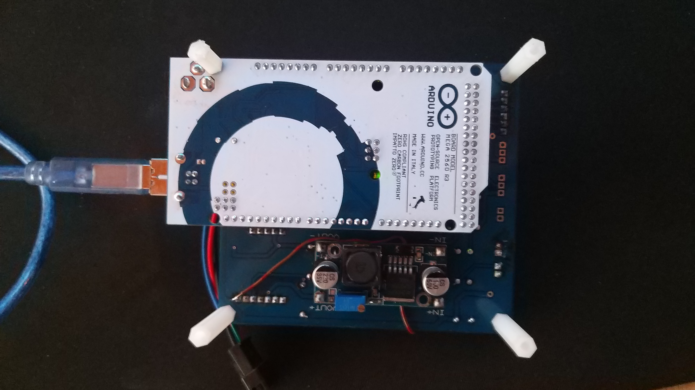
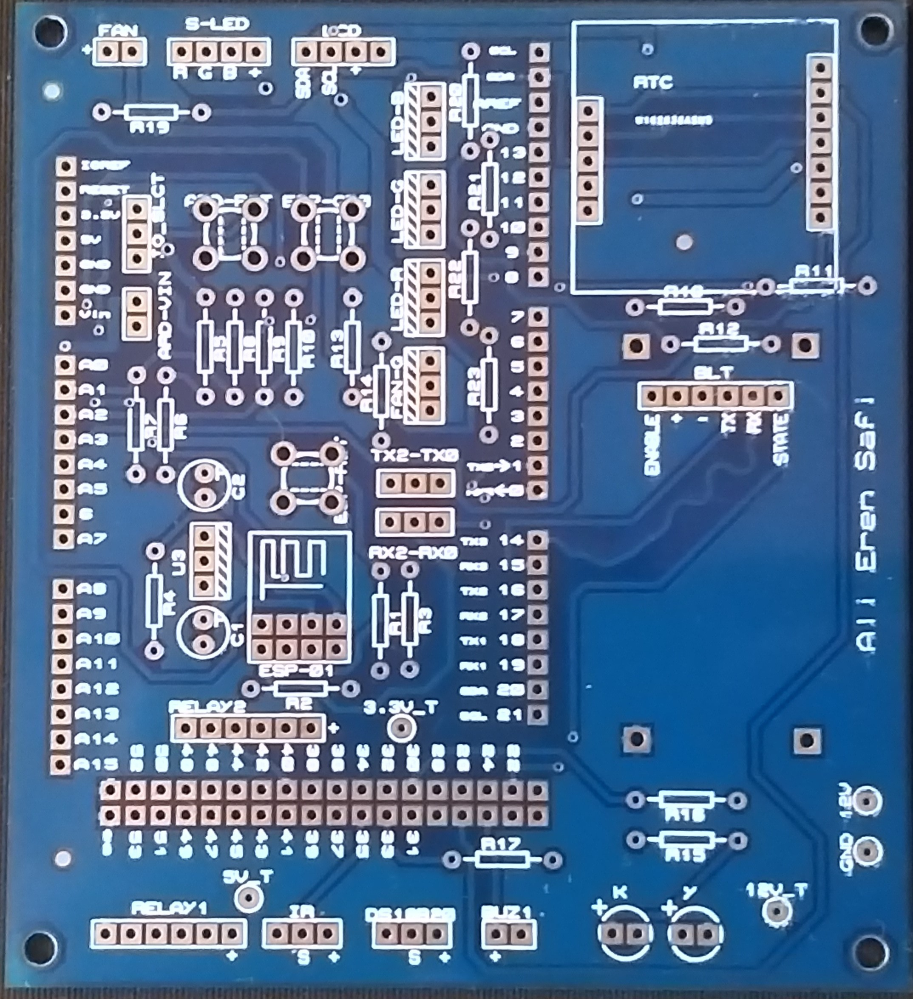
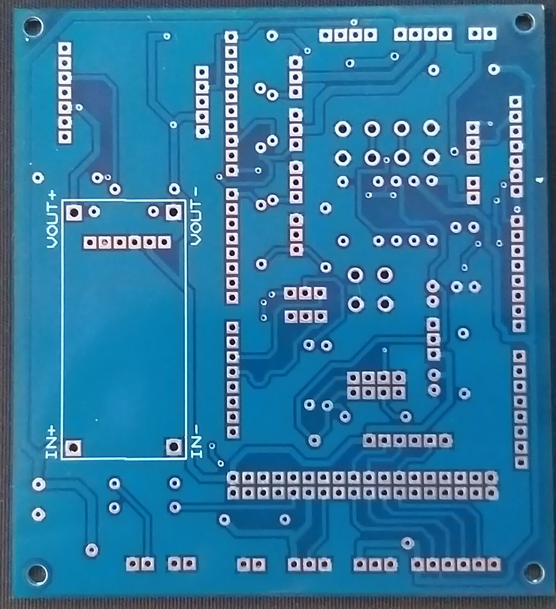
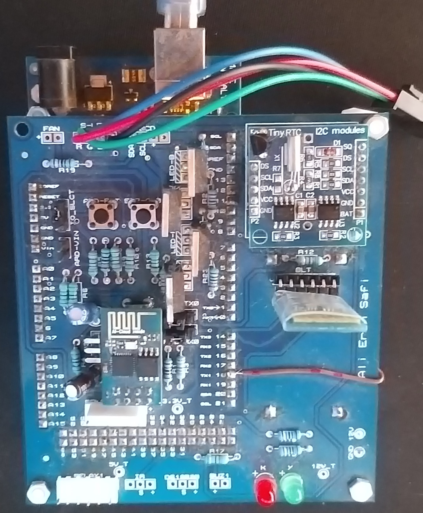
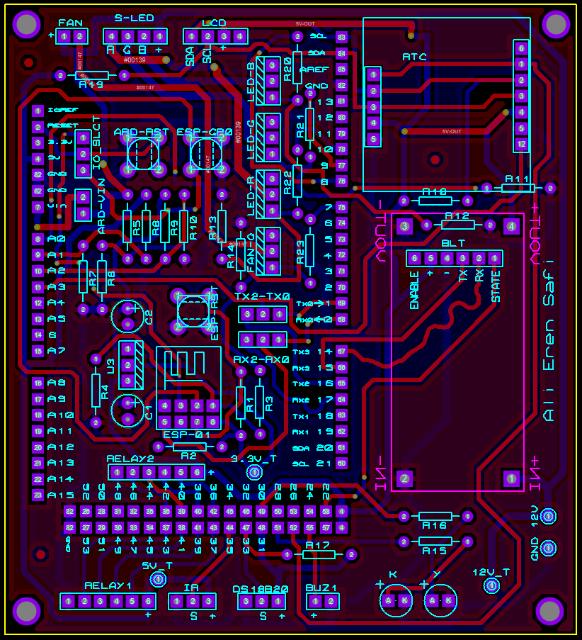
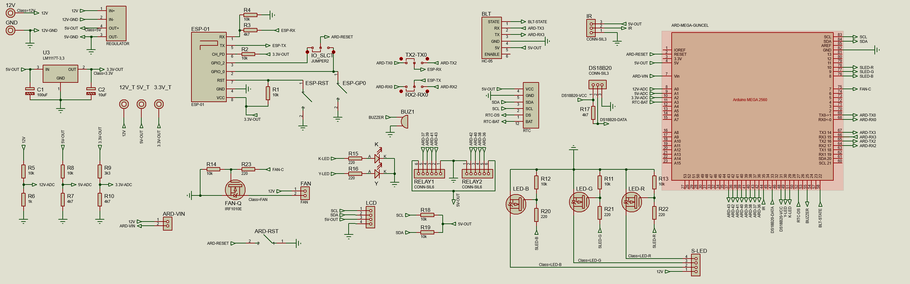

#  Aquarium Control System v1.0

An Arduino Mega 2560-based, modular, timer-driven (non-blocking) aquarium control and automation system.

[](https://www.arduino.cc/)
[](LICENSE)
[]()

<p align="center">
  
</p>

##  Features

- ** Temperature Monitoring**: 2-channel DS18B20 digital temperature sensor support
- ** Fan Control**: Automatic temperature-based or manual PWM fan control
- ** 8-Channel Relay**: Active LOW relay control
- ** Real-Time Clock**: DS3231 RTC module support
- ** LCD Display**: 20x4 I2C LCD support
- ** Voltage Monitoring**: 12V input, 5V, 3.3V regulator and RTC battery monitoring
- ** RGB LED Strip**: 8, 9, 10 pins with PWM control
- ** Alarm System**: High/low temperature, low voltage, low battery alarms
- ** Log System**: 40-entry event log
- ** Scheduling**: Scheduled tasks for 20 different scenarios
- ** EEPROM Support**: Persistent storage of settings
- ** Bluetooth Support**: Wireless control via HC-05/HC-06 module
- ** Status LEDs**: Green/Red status LEDs

##  Project Images

### Front and Back View
<p align="center">
  
  
</p>

### With Components
<p align="center">
  
</p>

### PCB Design
<p align="center">
  
  
</p>

##  Hardware Requirements

### Main Board
- Arduino Mega 2560 (requires Serial3 and high pin count)

### Sensors and Modules
| Component | Pin | Description |
|---------|-----|----------|
| DS18B20 (Inner) | 33 | OneWire temperature sensor |
| DS18B20 (Outer) | 27 | Sensor on TinyRTC |
| DS18B20 VCC | 31 | Sensor power control |
| PWM Fan | 44 | Timer5/OC5C fast PWM |
| Buzzer | 25 | Audio alert |
| LCD I2C | SDA/SCL | 20x4 LCD at address 0x27 |
| RTC DS3231 | SDA/SCL | RTC module at address 0x68 |
| EEPROM | SDA/SCL | External EEPROM at address 0x50 |
| Bluetooth | 22 (state), Serial3 | HC-05/HC-06 module |
| RGB LED Strip | 10(R), 9(G), 8(B) | PWM controlled RGB strip |

### Voltage Measurement Channels
| Channel | Pin | Divider | Max Voltage |
|-------|-----|--------|-------------|
| 12V Input | A0 | 10k/4.7k | ~15.63V |
| Arduino 5V | A1 | 10k/4.7k | ~6.06V |
| ESP 3.3V | A2 | 3.3k/4.7k | ~6.65V |
| RTC Battery | A3 | 4.7k/15k | ~6.56V |

### Relay Pins
Relays are configured as active LOW:
```cpp
const uint8_t RELAY_PINS[8] = {36, 38, 40, 42, 43, 41, 39, 37};
```

### Status LEDs
- Green LED (Pin 30 - PC7): System heartbeat
- Red LED (Pin 29 - PA7): Alarm status

##  Project Structure

```
Aquarium-Controller/
 Code/                          # Source code
    Code.ino                   # Main sketch file
    config.h                   # Hardware configuration
    globals.cpp/h              # Global variables
    scheduler.h                # Timer/Delay classes
    mutex.cpp/h                # Mutex wrappers
    actuator.cpp/h             # Fan and scenario management
    relays.cpp/h               # Relay control
    voltage.cpp/h              # Voltage measurement
    ds18b20.cpp/h              # Temperature sensors
    rtc_driver.cpp/h           # RTC driver
    alarm_manager.cpp/h        # Alarm system
    logger.cpp/h               # Event logging
    command_parser.cpp/h       # Serial command processor
    rgb_strip.cpp/h            # RGB LED control
    time_utils.cpp/h           # Time formatting
    ...
 images/                        # Project images
    front.jpg                  # Front view
    back.jpg                   # Back view
    with_components.jpg        # With components
    pcb.PNG                    # PCB design
    schematic.PNG              # Schematic diagram
    List.PNG                   # Bill of materials
 Aquarium_Scheme.PDF            # Circuit schematic
 LICENSE                        # License file
 README.md                      # This file
```

##  Dependencies

The following Arduino libraries are required:

```bash
arduino-cli lib install OneWire
arduino-cli lib install DallasTemperature
arduino-cli lib install RTClib
arduino-cli lib install "LiquidCrystal I2C"
```

Built-in libraries:
- Wire (I2C)
- EEPROM
- SPI

##  Build and Upload

### Using Arduino CLI

```bash
# Install board core
arduino-cli core install arduino:avr

# Install required libraries
arduino-cli lib install OneWire DallasTemperature RTClib "LiquidCrystal I2C"

# Compile
arduino-cli compile --fqbn arduino:avr:mega Code

# Upload (replace COM5 with your port)
arduino-cli upload -p COM5 --fqbn arduino:avr:mega Code

# Serial monitor
arduino-cli monitor -p COM5 -c baudrate=115200
```

### Using Arduino IDE
1. Open `Code.ino` in Arduino IDE
2. Select Tools > Board > Arduino Mega 2560
3. Select Tools > Port > COM5 (or your port)
4. Click Upload

##  Serial Command Interface

The system accepts commands via USB (Serial) and Bluetooth (Serial3). Default baud rate: **115200**

### General Commands

| Command | Description |
|---------|----------|
| `help` or `?` | List all commands |
| `status` | Show system status |
| `time` | Show current time |
| `time DD/MM/YYYY HH:MM:SS` | Set time |
| `diag` | Hardware diagnostics |

### Temperature Commands

| Command | Description |
|---------|----------|
| `get temp` | Show temperature values |
| `set tempunit c\|f` | Set unit (Celsius/Fahrenheit) |
| `set targettemp 26.0` | Set target temperature |

### Fan Commands

| Command | Description |
|---------|----------|
| `get fan` | Show fan speed |
| `fan auto` | Automatic fan control |
| `fan speed 50` | Set fan speed to 50% (0-100) |

### Relay Commands

| Command | Description |
|---------|----------|
| `get relay` | Show relay status |
| `relay on 1` | Turn on relay 1 (1-8) |
| `relay off 1` | Turn off relay 1 |
| `relay toggle 1` | Toggle relay 1 |
| `relay all on` | Turn all relays on |
| `relay all off` | Turn all relays off |

### RGB LED Strip Commands

| Command | Description |
|---------|----------|
| `rgb` | Show current RGB status |
| `rgb on` / `white` | White light |
| `rgb off` | Turn off LED |
| `rgb red` | Red color |
| `rgb green` | Green color |
| `rgb blue` | Blue color |
| `rgb yellow` | Yellow color |
| `rgb cyan` | Cyan color |
| `rgb magenta` | Magenta color |
| `rgb orange` | Orange color |
| `rgb purple` | Purple color |
| `rgb rgb 255 128 0` | Custom RGB values (0-255) |
| `rgb brightness 50` | Set brightness to 50% (0-100) |

### Alarm Commands

| Command | Description |
|---------|----------|
| `alarm` | Show alarm thresholds |
| `alarm recover` | Clear all alarms |

### Log Commands

| Command | Description |
|---------|----------|
| `log all` | Show all log entries |
| `log last 10` | Show last 10 entries |
| `log clear` | Clear logs |

### EEPROM Commands

| Command | Description |
|---------|----------|
| `eeprom map` | Show EEPROM map |
| `eeprom clear` | Clear EEPROM (**Warning!**) |

### LED Commands

| Command | Description |
|---------|----------|
| `leds enable 0\|1` | Enable/disable LEDs |
| `leds status` | Show LED status |

##  Architecture

### Non-Blocking Design
The system runs on a timer-based non-blocking architecture without FreeRTOS:

```cpp
// Timers
Timer timerSensors(600000);   // 10 minutes
Timer timerDisplay(1000);     // 1 second
Timer timerSystem(5000);      // 5 seconds
Timer timerSerial(50);        // 50ms
```

### Task Structure

| Task | Period | Description |
|-------|---------|----------|
| `taskSensors()` | 10 min | Read temperature sensors |
| `taskDisplay()` | 1 sec | Update LCD |
| `taskSystem()` | 5 sec | RTC, alarms, scheduling, LEDs |
| `taskSerial()` | 50 ms | Process serial commands |

### Data Structures

#### Scenario
```cpp
struct Scenario {
    char    name[16];      // Scenario name
    uint8_t relayMask;     // Relay state
    uint8_t fanSpeed;      // Fan speed (0-100)
    float   targetTemp;    // Target temperature
    uint8_t active;        // Active?
};
```

#### Schedule
```cpp
struct Schedule {
    uint8_t scenIdx;       // Scenario index
    uint8_t dayMask;       // Day mask (bitmask)
    uint8_t hour;          // Hour
    uint8_t minute;        // Minute
    uint8_t active;        // Active?
};
```

### EEPROM Map

| Address | Size | Content |
|-------|-------|--------|
| 0x0000 | 32B | Header (EE_MAGIC) |
| 0x0020 | 64B | System Settings |
| 0x0060 | 480B | Scenarios (10 × 48B) |
| 0x0250 | 400B | Schedules (20 × 20B) |
| 0x03F0 | 32B | Alarm Configuration |
| 0x0410 | 256B | Log Entries (40 × 6B) |
| 0x0510 | 16B | NTP Settings |

##  Configuration

Hardware configuration can be modified in `config.h`:

```cpp
// Pin definitions
#define PIN_DS18B20_IN   33
#define PIN_DS18B20_OUT  27
#define PIN_FAN          44
#define PIN_BUZZER       25
#define PIN_RGB_RED      10
#define PIN_RGB_GREEN    9
#define PIN_RGB_BLUE     8

// Alarm thresholds (default)
#define DEFAULT_TEMP_HIGH  30.0f
#define DEFAULT_TEMP_LOW   20.0f
#define DEFAULT_VOLT_LOW   11.0f
#define DEFAULT_BAT_LOW    2.5f

// Fan auto control
#define FAN_TEMP_MIN  24.0f  // 0% fan
#define FAN_TEMP_MAX  30.0f  // 100% fan
```

##  Sample System Output

```
========================================
    AQUARIUM CONTROL SYSTEM v1.0
========================================
[INIT] Mutex... OK
[INIT] I2C... OK
[INIT] I2C Scan:
       0x50
       0x68
[INIT] LCD... OK
[INIT] RTC... OK
[INIT] DS18B20... OK
[INIT] Peripherals... OK
[INIT] EEPROM... OK (loaded)
========================================
SYSTEM READY!
Type 'help' for commands.
========================================
```

##  Troubleshooting

### Known Issues and Solutions

1. **Temperature sensor not reading**
   - Check DS18B20 pin connections
   - Verify 4.7kΩ pull-up resistor is installed

2. **RTC not starting**
   - Check I2C connections (SDA/SCL)
   - Verify CR2032 battery is installed

3. **LCD not working**
   - Ensure I2C address is 0x27
   - Check contrast adjustment

4. **Relays working in reverse**
   - Remember relay module is active LOW
   - `HIGH` = Off, `LOW` = On

5. **RGB LED not working**
   - Check connections to pins 8, 9, 10
   - Verify MOSFET/transistor drivers are properly connected
   - Check LED strip power supply (12V)

##  License

This project is licensed under the MIT License. See [LICENSE](LICENSE) for details.

---

**Note:** This project was developed for personal use. For aquarium livestock safety, please implement backup measures for critical systems.
